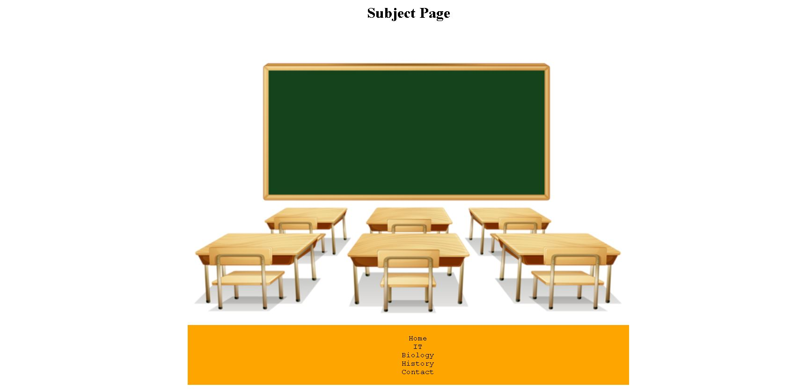

# css-practice-project
## Further practice using css styling methods to add to a html page.

* This project is another look at working with CSS styling to HTML pages.

Page example 1:

<spam>Happy Coding :sunglasses:
